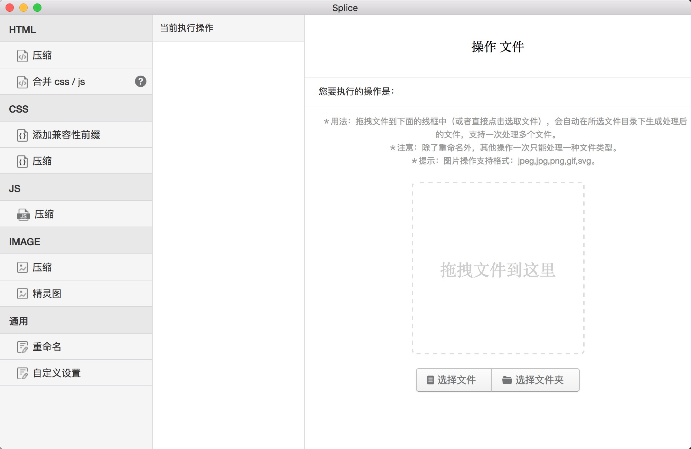

# splice
GUI workflow for Front-End developers based on Electron

## 功能

### 实现前端常用的文件处理功能：
1. HTML：
	- 压缩 html 
	- 通过 html 中的注释来合并 css / js
2. CSS：
	- 添加兼容性前缀
	- 压缩 css
	- 精灵图
		- 处理 css 文件并生成相应的精灵图
3. JS：
	- 压缩 js
4. IMAGE：
	- 压缩图片
	- 将多张图片合成精灵图并生成相应的 css
5. JSON：
	- 压缩 json
6. 通用：
	- 格式化
		- 格式化 JavaScript, JSON, HTML 和 CSS 等文件
	- 文件重命名
	- 自定义设置
		- 设置文件的导出目录

### 其他：
- 快捷键：
	- 刷新页面：Ctrl+Alt+R
	- 开启或关闭开发者工具：Ctrl+Alt+T
- 右键菜单：
	- 刷新：刷新页面
	- 开发者工具：开启或关闭开发者工具
	- 检查更新：检查是否有新版本

## 截图

### 界面：

### 简单操作：

## 下载地址

[win](https://github.com/SuperAL/splice/releases/download/1.1.0/Splice-win32-x64.zip) | [mac](https://github.com/SuperAL/splice/releases/download/1.1.0/Splice-darwin-x64.zip)

## 协议

[GNU General Public License v3.0](LICENSE)
本项目仅供学习交流和私人使用，禁止用作商业用途。

