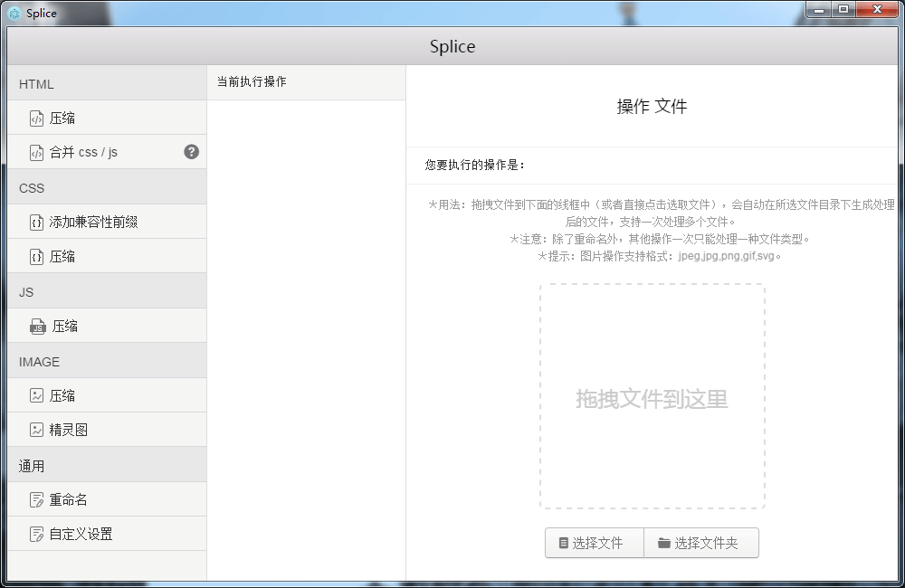
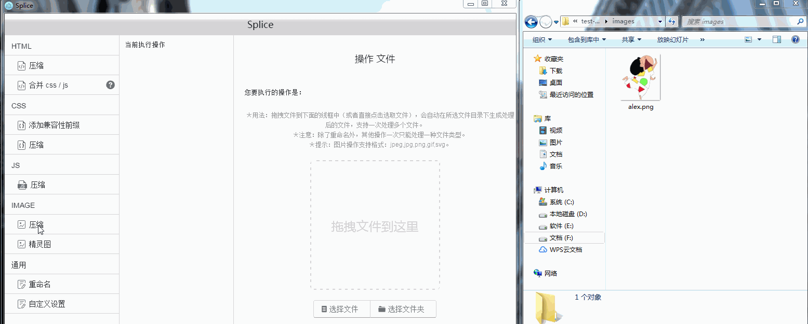

# splice
GUI workflow for Front-End developers based on Electron

# 功能
### 实现前端常用的文件处理功能：
1. HTML：
	- 压缩 html 
	- 通过 html 中的注释来合并 css / js
2. CSS：
	- 添加兼容性前缀
	- 压缩 css
3. JS：
	- 压缩 js
4. IMAGE：
	- 压缩图片
	- 将多张图片合成精灵图并生成相应的 css
5. 通用：
	- 文件重命名
	- 自定义设置
		- 设置文件的导出目录

### 其他：
- 快捷键：
	- 刷新页面：Ctrl+Alt+R
	- 开启或关闭开发者工具: Ctrl+Alt+T

# 截图
### 界面：

### 简单操作：

# 下载地址
[win](https://github.com/SuperAL/splice/releases/download/1.0.0/Splice-win32-x64.zip) | [mac](https://github.com/SuperAL/splice/releases/download/1.0.0/Splice-darwin-x64.zip)

